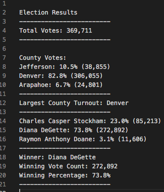
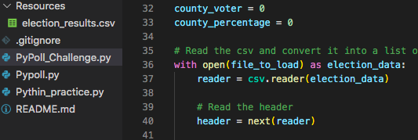
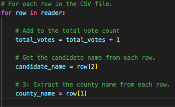

# Election_Analysis

## Overview of Election Audit
Overview of Election Audit: Explain the purpose of this election audit analysis.
The purpose of this analysis was to tally the total number of votes for each candidate and county as well as show the vote percentage.

## Resources
- Data Source: election_results.csv
- Software: Python 3.6.1, Visual Studio Code, 1.38.1

## Election-Audit Results
The analysis of the election show that:
- There were "369,711" votes cast in the election.
- The counties were:
  - Jefferson
  - Denver
  - Arapahoe
- The county results were:
  - Jefferson received "10.5%" of the votes and "38,855" number of votes
  - Denver received "82.8%" of the votes and "306,055" number of votes
  - Arapahoe received "6.7%" of the votes and "24,801" number of votes
- The county with the most votes was:
  - Denver won with "82.8%" of the votes and "306,055" number of votes
  
- The candidates were:
  - Charles Casper Stockham
  - Diana DeGette
  - Raymon Anthony Doane
The candidate results were:
  - Charles Casper Stockham received "23.0%" of the vote and "85,213" number of votes
  - Diana DeGette received "73.8%" of the vote and "272,892" number of votes
  - Raymon Anthony Doane received "3.1%" of the vote and "11,606" number of votes
- The winner of the election was:
  - Diana DeGette with "73.8%" of the vote and "272,892" number of votes
 
 
  
 
 ## Election-Audit Summary
 This code can be used on any election that has a csv file for all the votes. For this script you will have to also change the csv file to match your new one. The script would just have to be modified so that the candidate row and county row are in the right spot.
 

